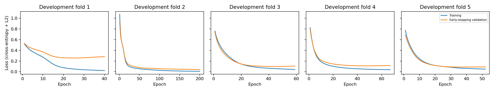
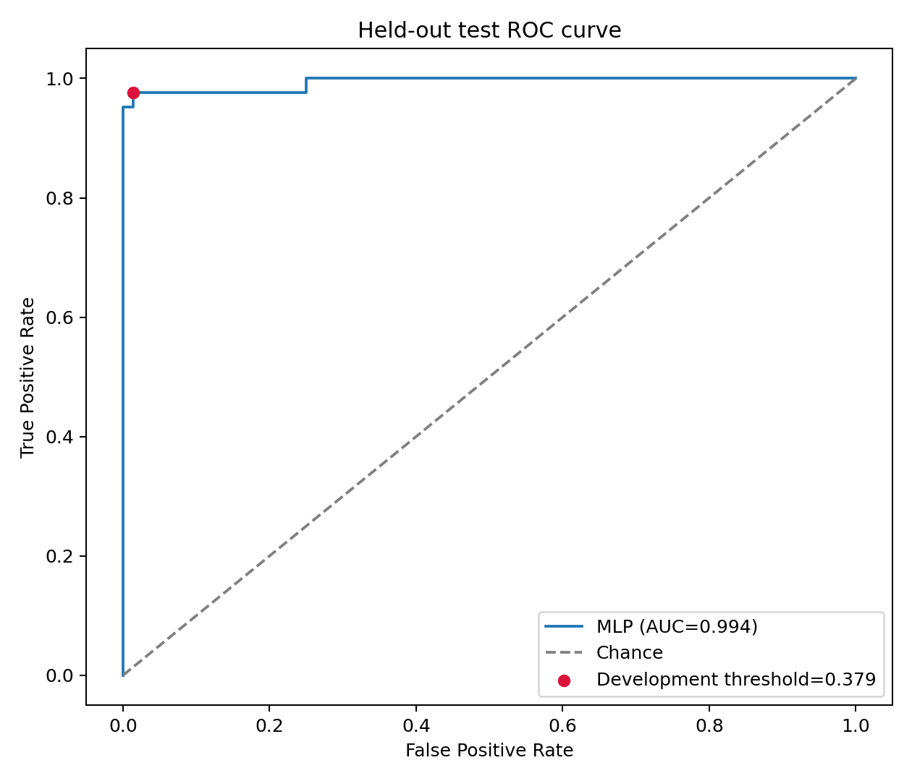
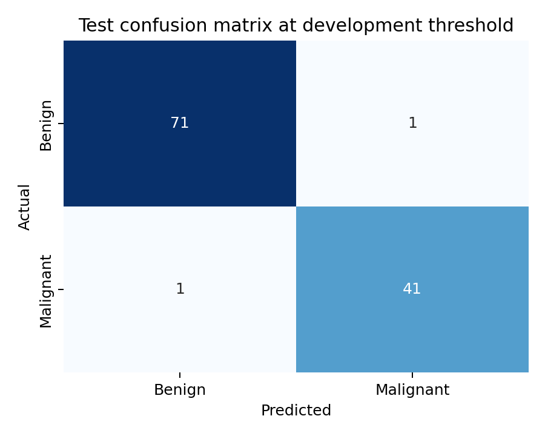

# Breast cancer classification using an MLP

## 1. Aim

Train a multilayer perceptron (MLP) to classify breast-mass samples as benign or malignant. Select an approximately equal-error-rate (EER) threshold using development data, then evaluate on a separate test set. Logistic regression is included as a simple baseline; the MLP is the main model.

## 2. Dataset and features

The UCI Wisconsin Diagnostic Breast Cancer dataset contains **569 samples: 357 benign and 212 malignant**. Features were extracted from digitized fine-needle aspirate images. The model receives numerical measurements, not images.

The raw data has 32 columns: ID, diagnosis, and **30 numerical input features**. Ten nucleus properties each have three summaries: **mean**, **standard error**, and **worst** (the average of the three largest values).

| Property | Meaning |
|---|---|
| Radius | Distance from centre to boundary |
| Texture | Variation in grayscale values |
| Perimeter | Boundary length |
| Area | Nucleus size |
| Smoothness | Local variation in radius lengths |
| Compactness | Shape measurement based on perimeter and area |
| Concavity | Severity of inward boundary indentations |
| Concave points | Number of concave portions of the contour |
| Symmetry | Symmetry of the nucleus |
| Fractal dimension | Boundary complexity |

For example, radius contributes `mean_radius`, `se_radius`, and `worst_radius`. Thus, 10 properties × 3 summaries = 30 features. The same pattern applies to every property above.

## 3. Cleaning and scaling

We exclude ID and use diagnosis only as the target (`B = 0`, `M = 1`). The loader checks the shape, missing values, and class counts. There are no missing feature values, so no imputation is needed. All 569 rows and all 30 predictors are retained. No outlier removal, PCA, feature selection, or oversampling is performed.

```python
X = raw[FEATURE_NAMES].copy()
y = raw['diagnosis'].map({'B': 0, 'M': 1}).to_numpy(dtype=int)
assert X.shape == (569, 30)
assert X.isna().sum().sum() == 0
```

Standardization subtracts the training mean and divides by the training standard deviation for each feature. This gives measurements with different units comparable scales. It does not map them to 0–1.

```python
scaler = StandardScaler()
X_fit = scaler.fit_transform(X.iloc[fit_idx])
X_stop = scaler.transform(X.iloc[stop_idx])
X_valid = scaler.transform(X.iloc[outer_valid])
```

Only the fitting subset determines scaling statistics within a cross-validation fold.

## 4. The 80/20 split and five-fold cross-validation

We first reserve a stratified **20% final test set**, using seed 42:

```python
dev_idx, test_idx = train_test_split(
    np.arange(len(y)), test_size=0.20, stratify=y, random_state=42
)
X_dev, y_dev = X.iloc[dev_idx], y[dev_idx]
X_test, y_test = X.iloc[test_idx], y[test_idx]
```

| Subset | Total | Benign | Malignant | Purpose |
|---|---:|---:|---:|---|
| Development (80%) | 455 | 285 | 170 | Model, threshold, and training-duration selection |
| Final test (20%) | 114 | 72 | 42 | Evaluation after choices are fixed |

We use **five stratified folds within the 455 development samples**, not across all 569 samples. Each round holds out 91 development samples. Of the remaining 364, 309 fit the MLP and 55 monitor early stopping (15% of 364, rounded up).

```python
splitter = StratifiedKFold(n_splits=5, shuffle=True, random_state=42)
for fold, (outer_train, outer_valid) in enumerate(splitter.split(X, y), 1):
    fit_idx, stop_idx = train_test_split(
        outer_train, test_size=0.15,
        stratify=y[outer_train], random_state=42 + fold
    )
```

Here `X` and `y` are the development data passed into the CV function. Every development sample receives one out-of-fold probability from a model that did not fit on that sample. The test set is excluded from this process.

## 5. How the MLP works

We compare four hidden-layer configurations of the MLP family: 16; 16–8; 32–16; and 32–16–8. Logistic regression is the only other model family.

A neuron computes a weighted sum of its inputs, adds a bias, and applies an activation. Hidden layers use `ReLU(z) = max(0, z)`, allowing nonlinear relationships. The final sigmoid maps the score to 0–1, interpreted as an estimated malignancy probability; calibration has not been established.

For the 16–8 example:

```text
30 standardized features → 16 ReLU neurons → 8 ReLU neurons → 1 sigmoid output
```

```python
model = tf.keras.Sequential([
    tf.keras.layers.Input(shape=(30,)),
    tf.keras.layers.Dense(16, activation='relu',
                          kernel_regularizer=tf.keras.regularizers.l2(1e-4)),
    tf.keras.layers.Dense(8, activation='relu',
                          kernel_regularizer=tf.keras.regularizers.l2(1e-4)),
    tf.keras.layers.Dense(1, activation='sigmoid'),
])
model.compile(optimizer=tf.keras.optimizers.Adam(learning_rate=0.001),
              loss='binary_crossentropy')
```

Weights and biases are trainable parameters, adjusted through backpropagation and Adam. The 16–8 example contains `(30×16+16) + (16×8+8) + (8×1+1) = 641` parameters. This is distinct from the 30 input features. The actual selected architecture is reported below.

Binary cross-entropy penalizes incorrect probabilities, especially confident errors. Batches contain up to 32 samples; each batch produces a weight update. One epoch is a pass through the fitting samples.

## 6. Early stopping and final training

Development models train for at most 200 epochs. Early stopping watches validation loss, waits 15 consecutive epochs without a new best value, and restores the best weights:

```python
tf.keras.callbacks.EarlyStopping(
    monitor='val_loss', patience=15, restore_best_weights=True
)
```

A sustained decrease in training loss alongside an increase in validation loss can indicate overfitting. A single fluctuation is not sufficient evidence. Early stopping may also occur at a plateau. L2 regularization discourages large hidden-layer weights. Neither mechanism guarantees absence of overfitting.

After selecting the architecture, the final epoch count is the median of its five best validation epochs. A fresh MLP is then trained on **all 455 development samples** for this fixed duration. A new scaler is fitted on those same development samples. The final fit does not use test loss or early stopping on test data.

```python
epochs = int(np.median(fold_tables[selected]['best_epoch']))
scaler = StandardScaler()
dev_scaled = scaler.fit_transform(X_dev)
test_scaled = scaler.transform(X_test)
mlp = build_mlp(30, ARCHITECTURES[selected])
mlp.fit(dev_scaled, y_dev, epochs=epochs, batch_size=32, verbose=0)
```



In this run, fold 1 shows a clear training/validation gap: training loss continues falling while validation loss bottoms out and then rises. This is evidence of overfitting during later epochs, and illustrates why the best validation weights are restored. Several other folds show smaller gaps or plateaus; fold 2 reaches the 200-epoch cap. These curves support using early stopping, not claiming that overfitting never occurs.

## 7. Architecture and threshold selection

For each MLP configuration, combine its 455 development out-of-fold probabilities. At each candidate threshold, compute `FPR = FP / (FP + TN)` and `FNR = FN / (FN + TP)`. Choose the observed ROC threshold minimizing `abs(FPR - FNR)`; empirical EER is their average at that threshold. Exact equality is not always possible with discrete sample counts.

Rank configurations by lowest **pooled development EER**, then highest pooled development AUC, then fewest parameters. This differs from the earlier experiment's mean-fold-EER selection rule: we now align selection with the single pooled operating threshold.

| MLP configuration | Parameters | Pooled development EER | Pooled development AUC |
|---|---:|---:|---:|
| MLP-2 (16-8) | 641 | 0.0240 | 0.9948 |
| MLP-3 (32-16) | 1537 | 0.0240 | 0.9937 |
| MLP-1 (16) | 513 | 0.0322 | 0.9938 |
| MLP-4 (32-16-8) | 1665 | 0.0352 | 0.9914 |

Selected MLP: **MLP-2 (16-8)**. Final training duration: **44 epochs**. Frozen development threshold: **0.379020**.

Mean fold EER averages five separately thresholded fold results. Pooled EER instead uses one threshold over all development predictions. They need not agree, because separately trained fold models can produce differently scaled probabilities. Development statistics guide selection; they are not the final test estimate.

Logistic regression uses the same five development validation folds, standardization, and its own pooled development EER threshold. It uses default regularization and `max_iter=2000`. It fits on all 364 training samples in each fold because it requires no early-stopping subset, then refits on all 455 development samples.

## 8. Final test results

Both models are evaluated on the same 114 held-out samples at their previously fixed thresholds. No test-based threshold search is performed.

```python
prediction = (test_probability >= development_threshold).astype(int)
tn, fp, fn, tp = confusion_matrix(y_test, prediction, labels=[0, 1]).ravel()
auc = roc_auc_score(y_test, test_probability)
```

| Metric | Main MLP | Logistic baseline |
|---|---:|---:|
| Frozen threshold | 0.3790 | 0.3025 |
| ROC AUC | 0.9937 | 0.9960 |
| Accuracy | 0.9825 | 0.9825 |
| Sensitivity / recall | 0.9762 | 0.9762 |
| Specificity | 0.9861 | 0.9861 |
| Precision | 0.9762 | 0.9762 |
| F1 | 0.9762 | 0.9762 |
| False-positive rate | 0.0139 | 0.0139 |
| False-negative rate | 0.0238 | 0.0238 |
| Mean of FPR and FNR | 0.0188 | 0.0188 |

The MLP confusion matrix is:

| Actual / predicted | Benign | Malignant |
|---|---:|---:|
| Benign | 71 | 1 |
| Malignant | 1 | 41 |

Accuracy is the proportion correct. Sensitivity is the proportion of malignant samples detected; specificity is the proportion of benign samples correctly classified. Precision is the proportion of malignant predictions that are correct. F1 is the harmonic mean of precision and recall. AUC measures ranking across thresholds, not percentage accuracy.

**The test mean error rate is not called EER:** the frozen development threshold need not make test FPR and FNR equal. Choosing another threshold using test labels would defeat the purpose of the holdout.





## 9. Interpretation and limitations

These nucleus measurements contain strong diagnostic signal; the original dataset documentation reports successful linear classification. High scores alone do not prove memorization. The logistic baseline provides context for whether extra neural-network complexity helps on this split; neither a small difference nor a single split establishes general superiority.

The protocol separates selection from final evaluation within this run. However, previous exploratory work used all 569 samples, so the new test set is not historically unseen. The dataset is small and historical, and one stratified split gives an uncertain estimate. One test error changes accuracy by approximately 0.88 percentage points. No external validation is performed.

The threshold learned from fold models may not transfer exactly to the refitted model because probability scales can change. We report the resulting test error rates without retuning. The development EER criterion balances error rates; it does not assert that the consequences or costs of the two errors are equal. These results are an educational classification experiment, not clinical validation.

## Dataset reference

Wolberg, W., Mangasarian, O., Street, N., & Street, W. (1993). *Breast Cancer Wisconsin (Diagnostic)*. UCI Machine Learning Repository. https://doi.org/10.24432/C5DW2B
